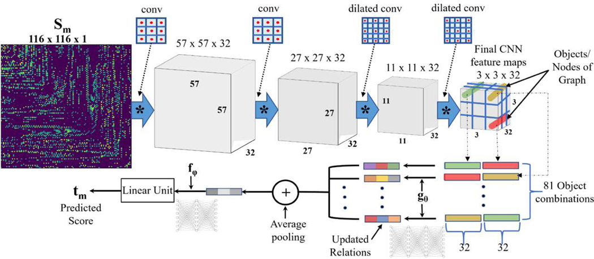

# Deep Relational Reasoning for the Prediction of Language Impairments and Postoperative Seizure Outcomes of Children With Focal Epilepsy


This is the official TensorFlow (Keras) implementation of the paper "[Deep Relational Reasoning for the Prediction of Language Impairment and Postoperative Seizure Outcome Using Preoperative DWI Connectome Data of Children With Focal Epilepsy](https://ieeexplore.ieee.org/document/9252947)" that was published in IEEE Transactions on Medical Imaging (TMI).

## Requirements
* Python >= 3.6
* [TensorFlow](https://www.tensorflow.org/) >= 2.0
* [keras-vis](https://raghakot.github.io/keras-vis/) (for GRAD-CAM visualization)
* [mat73](https://pypi.org/project/mat73/)

## Get Started (Preprocessing)
The following steps are required to replicate our work:

* The data of 51 patients has already been augmented to 510 augmentations per patient (per vector) using SMOTE augmentation.
* Preprocess dataset and generate the five folds (both training and testing) of all 51 patients and their augmentations - Use the raw data (private) of different densities (Densities used in paper: 01-High; 04-Medium; 08-Low) consisting of vectors for each of the 51 patients and 510 augmentations per patient (i.e., 510*51 + 51 = 26061 vectors). First divide the data and the corresponding augmentations into training (41 patients + augmentations) and testing (10 patients and augmentations). Then, convert each vector to a 116x116 connectome matrix for each patient. 
* Language Impairment Dataset (Regression) - Use the script `convert_script_new_data_regression_to_divide_into_5_folds.m` inside `Connectome_regression_data` folder to divide into training and testing (for the 5-fold cross validation) and convert the vectors into 116x116 shaped connectome matrices for both expressive and receptive scores. The data is saved to `Connectome_regression_data/processed_data/expressive_data_or_receptive_data/foldk`, where `k` is the fold number.     
* Seizure Outcome Dataset (Classification) - Use the script `convert_script_new_data_classification_to_generate_five_folds.m` inside `Connectome_classification_data` folder to divide into training and testing (for the 5-fold cross validation) and convert the vectors into 116x116 shaped connectome matrices for seizure outcome classification. The data is saved to `Connectome_classification_data/new_classification_data/foldk`, where `k` is the fold number.   

## Training and Testing

* All the training and testing scripts are located in the `networks` folder.
* Train and test the language impairment expressive score model
```
python dilate_CNN_RN_expressive.py
```
* Train and test the language impairment receptive score model
```
python dilate_CNN_RN_receptive.py
```
* Train and test the postoperative seizure outcome model
```
python dilate_CNN_RN_classify_new.py
```
* Note 1: The paths to the training and testing dataset must be provided correctly inside all of the above scripts.
* Note 2: In all of the above scripts, uncomment the lines to save the trained model weights (.h5 file) and model architecture (.json file). These will be required during the activation map visualization.

## Activation map visualization
* The visualization requires the keras-vis library.
* Refer to the `GRAD_CAM` folder to generate activation maps using the pretrained models (both weights in .h5 files and model architecture in .json files) and the test data inside `GRAD_CAM/processed_data/expressive_data_or_receptive_data`.
* The script to generate the activation maps are located inside `GRAD_CAM/keras-vis`. The scripts to generate activation maps for seizure classification are: `GRAD_CAM_EP_class_0_seizure.py` and `GRAD_CAM_EP_class_1_seizure.py`. The scripts to generate activation maps for language impairments are: `GRAD_RAM_EP_expressive.py` and `GRAD_RAM_EP_receptive.py`.
* Note 1: The paths to the test dataset must be provided correctly inside all the scripts.
* Note 2: The top 20 predictions are considered for visualization.

## Cite
Please cite our paper if you find this work useful for your research:
```
@article{banerjee2020deep,
  title={Deep relational reasoning for the prediction of language impairment and postoperative seizure outcome using preoperative DWI connectome data of children with focal epilepsy},
  author={Banerjee, Soumyanil and Dong, Ming and Lee, Min-Hee and O’Hara, Nolan and Juhasz, Csaba and Asano, Eishi and Jeong, Jeong-Won},
  journal={IEEE transactions on medical imaging},
  volume={40},
  number={3},
  pages={793--804},
  year={2020},
  publisher={IEEE}
}
```
